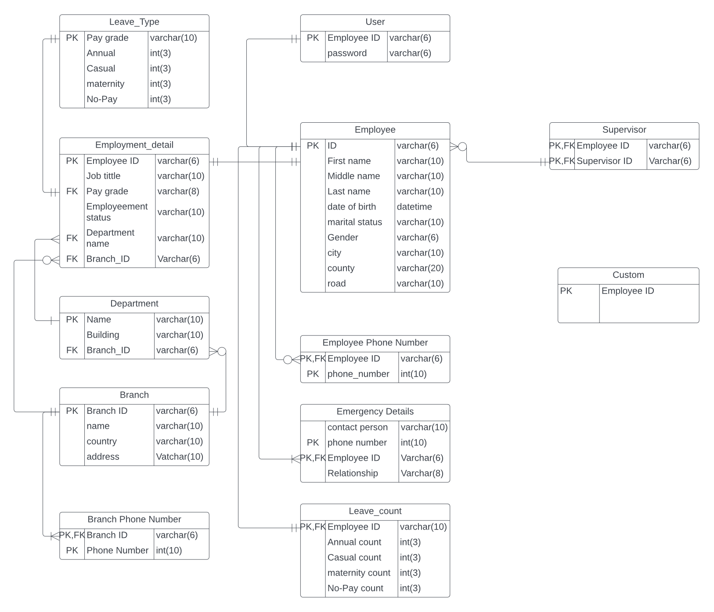

# Jupiter_HRM
 Jupiter Human Resource Management System

# Jupiter Human Resource Management System

Welcome to the Jupiter Human Resource Management System! This system is designed to streamline and automate various HR processes within your organization.

 
<em>Landing Page<em/>

 

 
<em>Entity Diagram<em/>

## Features

- Employee management: Keep track of employee information, such as personal details, job history, and performance records.
- Leave management: Manage employee leave requests, track leave balances, and generate leave reports.
- Attendance tracking: Monitor employee attendance and generate attendance reports.
- Performance evaluation: Conduct performance evaluations and track employee performance over time.
- Payroll management: Calculate and manage employee salaries, deductions, and bonuses.
- Recruitment: Streamline the recruitment process by managing job postings, applications, and candidate evaluations.

## Getting Started

To get started with the Jupiter HRM system, follow these steps:

1. Clone the repository: `git clone https://https://github.com/sanjulagathsara/Jupiter-Human_Resource-Management-System.git`
2. Install the necessary dependencies: `npm install`
3. Configure the database connection in the `.env` file.
4. Run the application: `npm start`
5. Access the application in your browser at `http://localhost:3000`

## Contributing

We welcome contributions from the community! If you'd like to contribute to the Jupiter HRM system, please follow these guidelines:

1. Fork the repository.
2. Create a new branch for your feature or bug fix.
3. Make your changes and commit them.
4. Push your changes to your forked repository.
5. Submit a pull request to the main repository.

